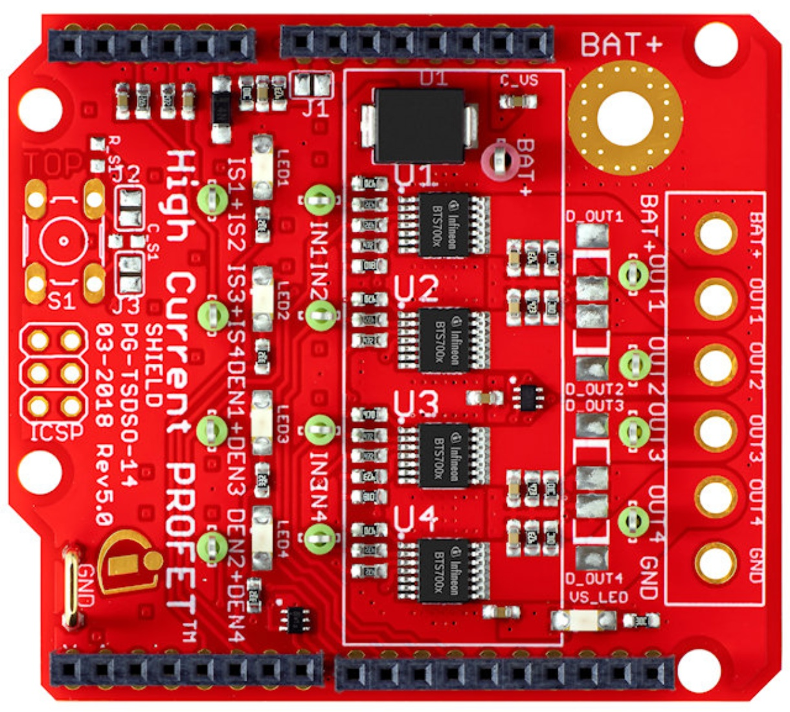

# Smart High-Side Swicht

C++ library for Infineon's Arduino shield SHIELD_BTS700x-1EPP with the **Smart High-Side Power Swicht BTS700x-1EPP**

1. [Overview](#ovw)  
2. [Supported Hardware](#s-hw)  
3. [Software Requirements](#sw-req)
4. [Library Usage](#lib-usage)
5. [Demo Applications Example](#demo-ex)
6. [References](#refs)

## 1. Overview

## 2. Supported Hardware

### SHIELD_BTS7002-1EPP
The library has been customized for the Arduino-Adapter-Shield ***SHIELD_BTS700x-1EPP*** and for the Arduino environment. It works with all available versions of the board (SHIELD_BTS7002-1EPP, SHIELD_BTS7004-1EPP, SHIELD_BTS7006-1EPP, SHIELD_BTS7008-1EPP).

A detailed explanation of the board and its features can be found in the [user manual](https://www.infineon.com/dgdl/Infineon-PROFET+2_12V_Arduino_Shield-UserManual-v01_00-EN.pdf?fileId=5546d4626df6ee62016dfe3f1eff118b). The user manual also contains the pinout as well as the schematics of the board.

### Verified Hardware
The shield is designed to be directly stacked on boards which have the Arduino UNO form factor.
Therefore, the library has been built and successfully deployed to the following platforms:

MCU Platforms |
---           |
[XMC1100 Boot Kit](https://www.infineon.com/cms/en/product/evaluation-boards/kit_xmc11_boot_001/#ispnTab1) |
[XMC4700 Relax Kit for 5V Shields](https://www.infineon.com/cms/en/product/evaluation-boards/kit_xmc47_relax_5v_ad_v1/) |
[Arduino Uno Rev3](https://store.arduino.cc/arduino-uno-rev3) |

### Additional hardware platforms
The library platform is meant to be directly compatible with any other platfrom that has the Arduino UNO form factor. Every new validated hardware platform will be added to the MCU platfrom list above.

## 3. Software Requirements

## 4. Library Usage

## 5. Demo Applications Example

## 6. References

