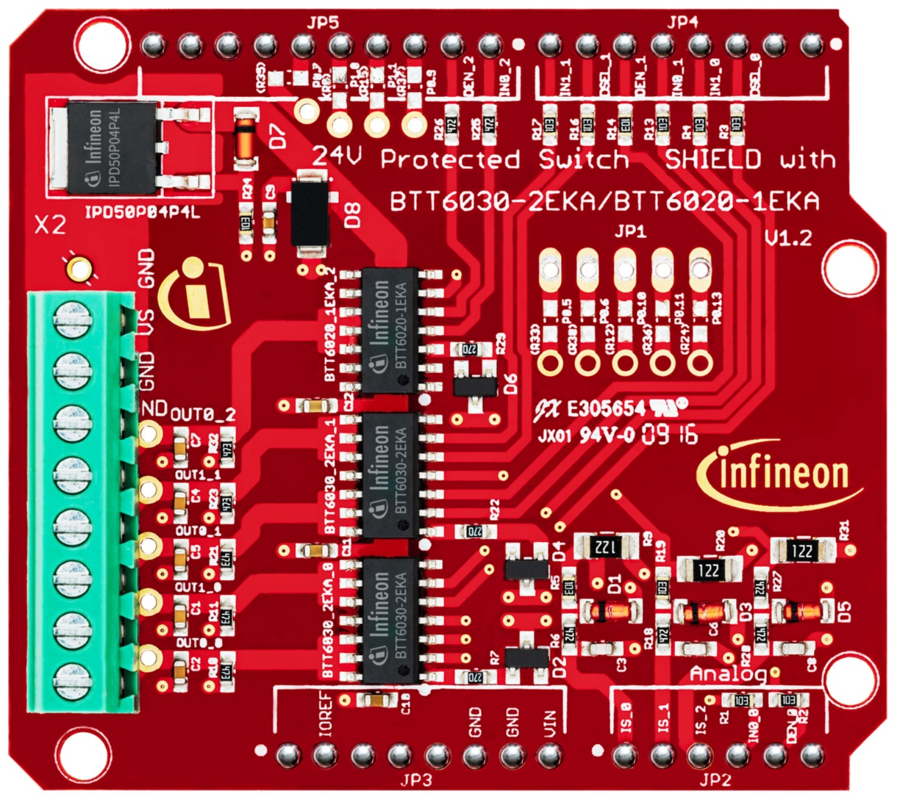
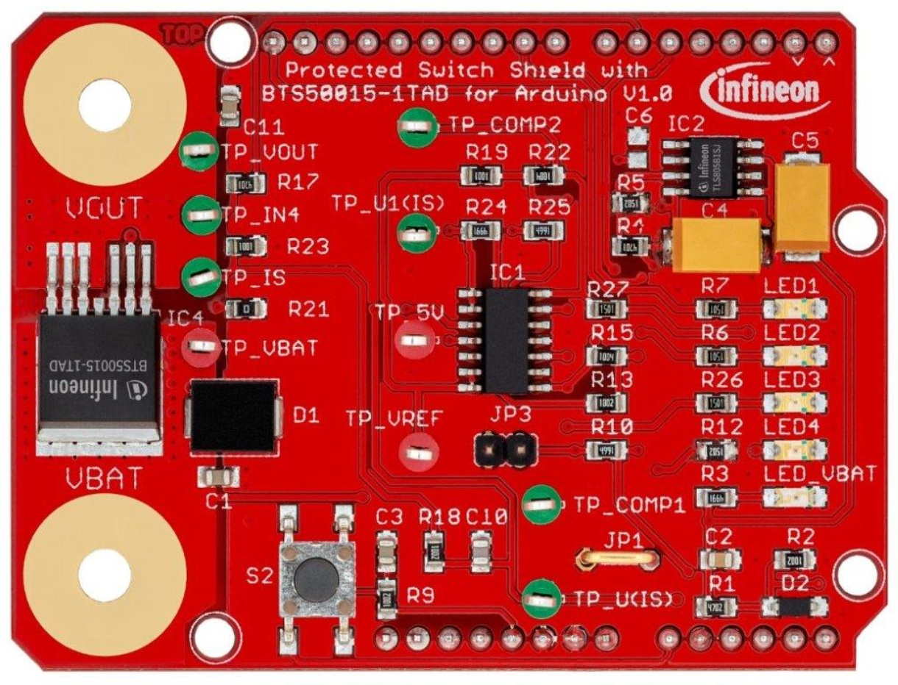
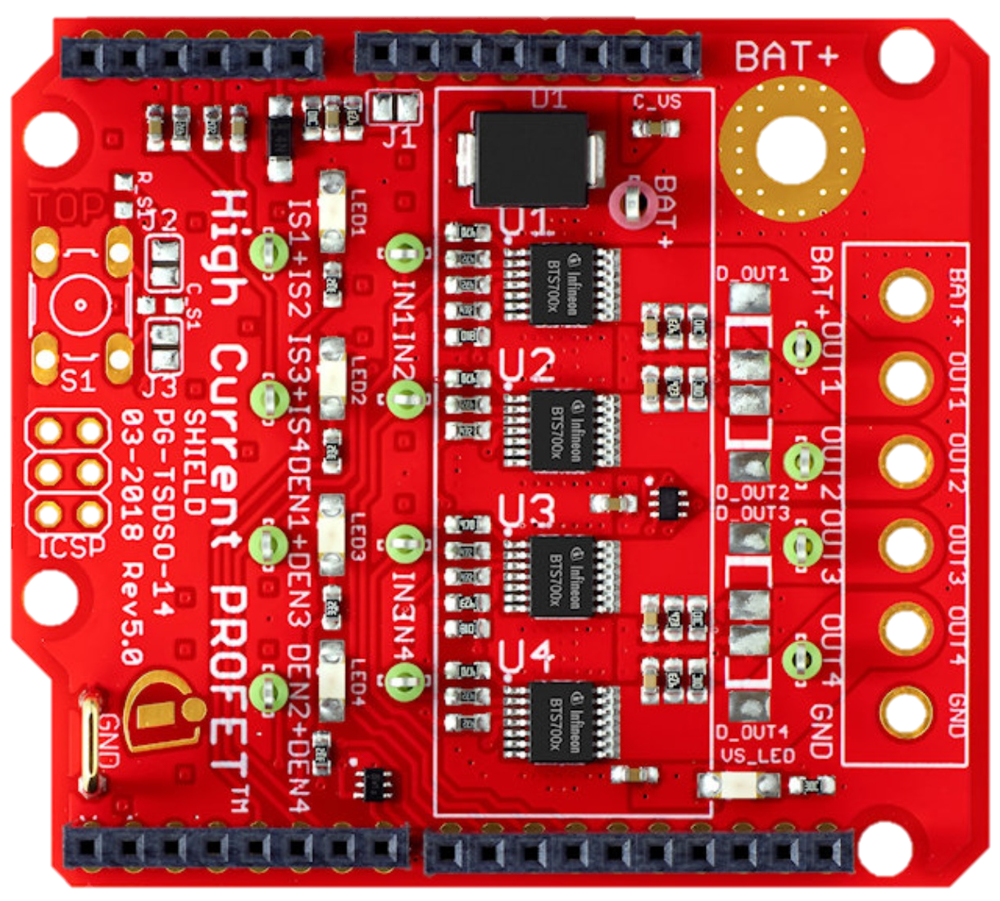
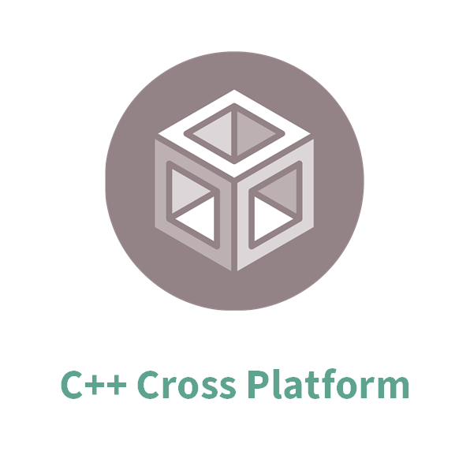

# Smart High-Side Switch

C++ library for Infineon's Arduino shields for **PROFET™ Smart High-Side Power Switches** Automotive grade

## Supported Products

<table>
    <tr>
        <td></td>
        <td></td>
        <td></td>
        <td></td>
        <td></td>
    </tr>
    <tr>
        <td style="test-align : center"><a href="https://high-side-switch.readthedocs.io/en/latest/hw-platforms.html#profettrade-24v-family">PROFET™+ 24V BTT60xx Arduino Shield</a></td>
        <td style="test-align : center"><a href="https://high-side-switch.readthedocs.io/en/latest/hw-platforms.html#power-profettrade-family">Power PROFET™ BTS5001x-1TAD Arduino Shield</a></td>
        <td style="test-align : center"><a href="https://high-side-switch.readthedocs.io/en/latest/hw-platforms.html#profettrade-2-12v-family">PROFET™+2 12V BTS700x-1EPP Arduino Shield</a></td>
        <td style="test-align: center"><a href="https://high-side-switch.readthedocs.io/en/latest/hw-platforms.html#id5">Power PROFET™ + 12 V BTS500xx-1LUA</a></td>
        <td style="test-align : center"><a href="">Power PROFET™ + 24V/48V BTH500xx-1LAU</a></td>
    </tr>
</table>

## Supported Frameworks

<table>
    <tr>
        <td></td>
        <td></td>
    </tr>
    <tr>
        <td style="text-align: center"><a href="https://high-side-switch.readthedocs.io/en/latest/sw-frmwk/arduino/arduino-api.html#arduino-api">Arduino API</a></td>
        <td style="text-align: center">
            <a href="https://high-side-switch.readthedocs.io/en/latest/api-reference/profet-24-api.html#btt60xxshield-api">PROFET™+ 24V BTT60xx API</a> 
            <a href="https://high-side-switch.readthedocs.io/en/latest/api-reference/power-profet-api.html#power-profettrade-shield">Power PROFET™ BTS5001x API</a> 
            <a href="https://high-side-switch.readthedocs.io/en/latest/api-reference/profet2-12-api.html#profettrade-2-12v-shield">PROFET™+2 12V BTS700x API</a> 
            <a href="https://high-side-switch.readthedocs.io/en/latest/api-reference/power-profet-1LUA-api.html#power-profettrade-shield-1lua">Power PROFET™ + 12 V BTS500xx API</a> 
            <a href="">Power PROFET™ + 24V/48V BTH500xx API</a>
        </td>
    </tr>
    <tr>
        <td style="text-align: center"><a href="https://high-side-switch.readthedocs.io/en/latest/sw-frmwk/arduino/arduino-getting-started.html#arduino-getting-started">Getting Started</a></td>
        <td style="text-align: center"><a href="https://high-side-switch.readthedocs.io/en/latest/lib-details/porting-guide.html#porting-guide">Porting Guide</a></td>
    </tr>
</table>

## More information

The complete documentation of the library as well as detailed information about the PROFET-shield, can be found in the [Wiki](https://high-side-switch.readthedocs.io/en/latest/index.html).

## License

This project is licensed under the MIT License - click [here](https://github.com/Infineon/high-side-switch/blob/master/LICENSE) for details.