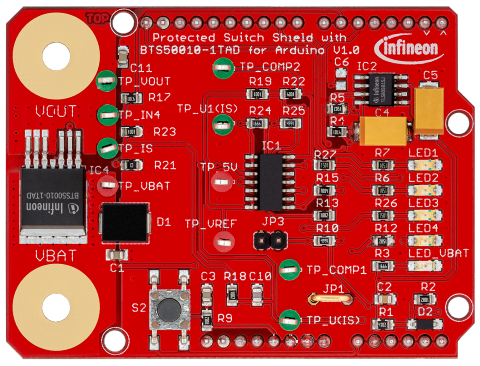
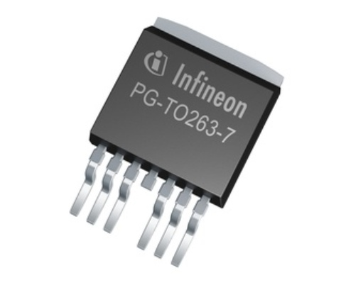
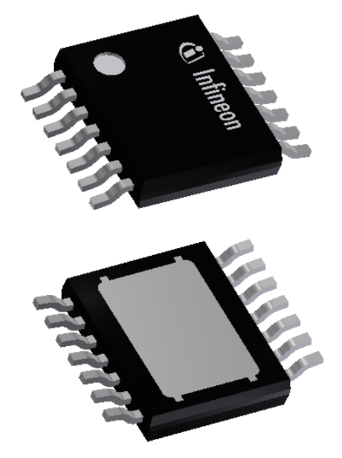

The following Infineon products are supported by this library:

PROFET\ |trade|\ + 24V family
-----------------------------
.. |trade|    unicode:: U+2122 .. TRADEMARK SIGN

.. image:: img/btt6x_shield.jpg
    :width: 150

.. image:: img/btt6x_chip.jpg
    :width: 150

Shields for Arduino
"""""""""""""""""""

* `24V Protected Switch Shield with BTT6030-2EKA and BTT6020-1EKA`_

Pinout Diagram
^^^^^^^^^^^^^^

Pin Description
^^^^^^^^^^^^^^^

.. list-table::
    :header-rows: 1

    * - Arduino Pin
      - Symbol
      - Type
      - Function
    * - GND
      - GND
      - \-
      - Ground
    * - D2
      - DSEL 0
      - Input/digital
      - Diagnostic select PROFET\ |trade|\ + 24V device no. 0. Selects if the diagnosis of channel 0 or 1 is muxed to the IS Pin.
    * - D3
      - IN 0.1
      - Input/PWM
      - Input to switch channel 1 on PROFET\ |trade|\ + 24V device no. 0.
    * - D4
      - IN 1.0
      - Input/PWM
      - Input to switch channel 0 on PROFET\ |trade|\ + 24V device no. 1.
    * - D5
      - DEN 1
      - Input/digital
      - Turns diagnosis for PROFET\ |trade|\ + 24V device no. 1 on or off.
    * - D6
      - DSEL 1
      - Input/digital
      - Diagnostic select PROFET\ |trade|\ + 24V device no. 1. Selects if the diagnosis of channel 0 or 1 is muxed to the IS Pin.
    * - D7
      - IN 1.1
      - Input/PWM
      - Input to switch channel 1 on PROFET\ |trade|\ + 24V device no. 1.
    * - D8
      - IN 2
      - Input/PWM
      - Input to switch channel on PROFET\ |trade|\ + 24V device no. 2.
    * - D9
      - DEN 2
      - Input/digital
      - Turns diagnosis for PROFET\ |trade|\ + 24V device no. 2 on or off.
    * - A0
      - IS 0
      - Output/analog
      - Current sense of PROFET\ |trade|\ + 24V device no. 0
    * - A1
      - IS 1
      - Output/analog
      - Current sense of PROFET\ |trade|\ + 24V device no. 1
    * - A2
      - IS 2
      - Output/analog
      - Current sense of PROFET\ |trade|\ + 24V device no. 2
    * - A3
      - IN 0.0
      - Input/PWM
      - Input to switch channel 0 on PROFET\ |trade|\ + 24V device no. 0.
    * - A4
      - DEN 0
      - Input/digital
      - Turns diagnosis for PROFET\ |trade|\ + 24V device no. 0 on or off.
    * - \-
      - OUT x.y
      - \-
      - Power output of channel y on PROFET\ |trade|\ + 24V device no. x.
    * - \-
      - Vs
      - \-
      - Supply input

Chip only
"""""""""

* `BTT6020-1EKA`_
* `BTT6030-2EKA`_

-----------

Power PROFET\ |trade|\  family
------------------------------

Shields for Arduino
"""""""""""""""""""

* `12V Protected Switch Shield with BTS50010-1TAD`_
* `12V Protected Switch Shield with BTS50015-1TAD`_

Pinout Diagram
^^^^^^^^^^^^^^

Pin Description
^^^^^^^^^^^^^^^

.. list-table::
    :header-rows: 1

    * - Arduino Pin
      - Symbol
      - Type
      - Function
    * - GND
      - GND
      - \-
      - Ground
    * - D5
      - TP COMP 1
      - Output/digital
      - Input to check state of comparator 1, can be measured at test point TP_COMP1.
    * - D6
      - IN - BTS500xx
      - Input/PWM
      - Input of BTS500xx chip to switch on / off.
    * - D9
      - LED2
      - Input/PWM
      - Input to shield LED no. 2.
    * - D19
      - LED1
      - Input/PWM
      - Input to shield LED no. 1.
    * - A0
      - S2
      - Output/digital
      - Handling of user input. External Key can be connected, low active.
    * - A2
      - IS
      - Output/analog
      - Measuring of current IS.
    * - A3
      - TP 5V
      - Output/analog
      - Measuring availability of 5V.
    * - A5
      - VBAT
      - Output/analog
      - Measuring of VBAT via voltage divider.

Chip only
"""""""""

* `BTS50010-1TAD`_
* `BTS50015-1TAD`_

---------------

.. image:: img/BTS50010_1LUA_Chip.jpg
  :width: 150

Shields for Arduino
"""""""""""""""""""
* `12V Protected Switch Shield with BTS50005-1LUA and BTS50010-1LUA`_

Pinout Diagram
^^^^^^^^^^^^^^

Pin Description
^^^^^^^^^^^^^^^
.. list-table::
    :header-rows: 1

    * - Arduino Pin
      - Symbol
      - Type
      - Function
    * - D9
      - DEN2
      - Output/digital
      - Diagnosis enable pin for switch 2
    * - D10
      - IN2
      - Output/digital
      - Enable pin for switch 2
    * - D11
      - DEN1
      - Output/digital
      - Diagnosis enable pin for switch 1
    * - D12
      - IN1
      - Output/digital
      - Enable pin for switch 1
    * - A0
      - IS1
      - Input/analog
      - Analog measurement of the current through switch 1
    * - A1
      - VS_M
      - Input/analog
      - Analog measurement of the supply voltage
    * - A2
      - TEMP_M
      - Input/analog
      - Analog measurement of the PCB temperature
    * - A3
      - VOUT_M
      - Input/analog
      - Analog measurement of the output voltage of switch 1
    * - A4
      - IS2
      - Input/analog
      - Analog measurement of the current through switch 2

Chip only
^^^^^^^^^
* `BTS50005-1LUA`_
* `BTS50010-1LUA`_

------------------------------

PROFET\ |trade|\ +2 12V family
------------------------------

.. image:: img/bts700x_shield.jpg
    :width: 150

Shields for Arduino
"""""""""""""""""""

* `12V Smart Switch Shield with BTS7002-1EPP`_
* `12V Smart Switch Shield with BTS7004-1EPP`_
* `12V Smart Switch Shield with BTS7006-1EPP`_
* `12V Smart Switch Shield with BTS7008-1EPP`_

Pinout Diagram
^^^^^^^^^^^^^^

Pin Description
^^^^^^^^^^^^^^^

.. list-table::
    :header-rows: 1

    * - Arduino Pin
      - Symbol
      - Type
      - Function
    * - GND
      - GND
      - \-
      - Ground
    * - D2
      - Push button digital
      - Output/digital
      - Push button digital (optional).
    * - D3
      - IN4
      - Input/PWM
      - Input PROFET\ |trade|\ +2 device U4.
    * - D4
      - LED1
      - Input/PWM
      - Indicator LED 1.
    * - D5
      - LED2
      - Input/PWM
      - Indicator LED 2.
    * - D6
      - DEN 1+3
      - Input/digital
      - Diagnosis enable PROFET\ |trade|\ +2 device U1+U3.
    * - D7
      - OLOFF
      - Input/digital
      - Option for *Open Load in OFF* detection.
    * - D8
      - DEN 2+4
      - Input/digital
      - Diagnosis enable PROFET\ |trade|\ +2 device U2+U4.
    * - D9
      - IN1
      - Input/PWM
      - Input PROFET\ |trade|\ +2 device U1.
    * - D10
      - IN2
      - Input/PWM
      - Input PROFET\ |trade|\ +2 device U2.
    * - D11
      - IN3
      - Input/PWM
      - Input PROFET\ |trade|\ +2 device U3.
    * - D12
      - LED3
      - Input/PWM
      - Indicator LED 3.
    * - D13
      - LED4
      - Input/PWM
      - Indicator LED 4.
    * - \-
      - VIN
      - \-
      - Supply voltage.
    * - A0
      - Push button analog
      - Output/analog
      - Push button analog (optional).
    * - A1
      - VBAT
      - Output/analog
      - Measuring of VBAT via voltage divider.
    * - A2
      - IS 1+2
      - Output/analog
      - Current sense of PROFET\ |trade|\ +2 device U1+U2.
    * - A3
      - IS 3+4
      - Output/analog
      - Current sense of PROFET\ |trade|\ +2 device U3+U4.

Chip only
"""""""""

* `BTS7002-1EPP`_
* `BTS7004-1EPP`_
* `BTS7006-1EPP`_
* `BTS7008-1EPP`_

.. _`BTT6020-1EKA`: https://www.infineon.com/cms/en/product/power/smart-low-side-high-side-switches/high-side-switches/profet-plus-24v-automotive-smart-high-side-switch/btt6020-1era/
.. _`BTT6030-2EKA`: https://www.infineon.com/cms/en/product/power/smart-low-side-high-side-switches/high-side-switches/profet-plus-24v-automotive-smart-high-side-switch/btt6030-2era/
.. _`BTS50010-1TAD`: https://www.infineon.com/cms/en/product/power/smart-low-side-high-side-switches/high-side-switches/power-profet-automotive-smart-high-side-switch/bts50010-1tad/
.. _`BTS50015-1TAD`: https://www.infineon.com/cms/en/product/power/smart-low-side-high-side-switches/high-side-switches/power-profet-automotive-smart-high-side-switch/bts50015-1tad/
.. _`BTS50005-1LUA`: https://www.infineon.com/cms/de/product/power/smart-power-switches/high-side-switches/power-profet-plus-12v-automotive-smart-high-side-switch/bts50005-1lua/
.. _`BTS50010-1LUA`: https://www.infineon.com/cms/de/product/power/smart-power-switches/high-side-switches/power-profet-plus-12v-automotive-smart-high-side-switch/bts50010-1lua/
.. _`BTS7002-1EPP`: https://www.infineon.com/cms/en/product/power/smart-power-switches/high-side-switches/profet-plus-2-12v-automotive-smart-high-side-switch/bts7002-1epp/
.. _`BTS7004-1EPP`: https://www.infineon.com/cms/en/product/power/smart-low-side-high-side-switches/high-side-switches/profet-plus-2-12v-automotive-smart-high-side-switch/bts7004-1epp/
.. _`BTS7006-1EPP`: https://www.infineon.com/cms/en/product/power/smart-low-side-high-side-switches/high-side-switches/profet-plus-2-12v-automotive-smart-high-side-switch/bts7006-1epp/
.. _`BTS7008-1EPP`: https://www.infineon.com/cms/en/product/power/smart-low-side-high-side-switches/high-side-switches/profet-plus-2-12v-automotive-smart-high-side-switch/bts7008-1epp/

.. _`24V Protected Switch Shield with BTT6030-2EKA and BTT6020-1EKA`: https://www.infineon.com/cms/en/product/evaluation-boards/24v_shield_btt6030/
.. _`12V Protected Switch Shield with BTS50010-1TAD`: https://www.infineon.com/cms/en/product/evaluation-boards/shield_bts50010-1tad/
.. _`12V Protected Switch Shield with BTS50015-1TAD`: https://www.infineon.com/cms/en/product/evaluation-boards/shield_bts50015-1tad/
.. _`12V Protected Switch Shield with BTS50005-1LUA and BTS50010-1LUA`: https://www.infineon.com/cms/en/product/evaluation-boards/board-bts50005-1lua/
.. _`12V Smart Switch Shield with BTS7002-1EPP`: https://www.infineon.com/cms/en/product/evaluation-boards/shield_bts7002-1epp/
.. _`12V Smart Switch Shield with BTS7004-1EPP`: https://www.infineon.com/cms/en/product/evaluation-boards/shield_bts7004-1epp/
.. _`12V Smart Switch Shield with BTS7006-1EPP`: https://www.infineon.com/cms/en/product/evaluation-boards/shield_bts7006-1epp/
.. _`12V Smart Switch Shield with BTS7008-1EPP`: https://www.infineon.com/cms/en/product/evaluation-boards/shield_bts7008-1epp/