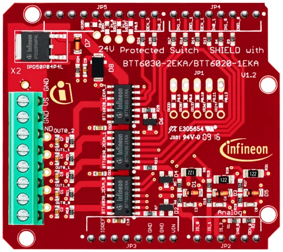
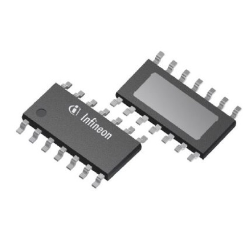
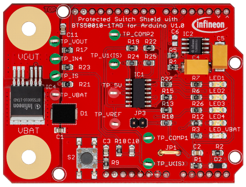
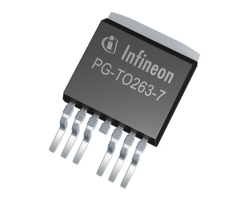
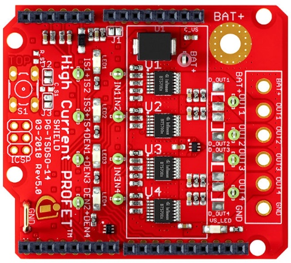
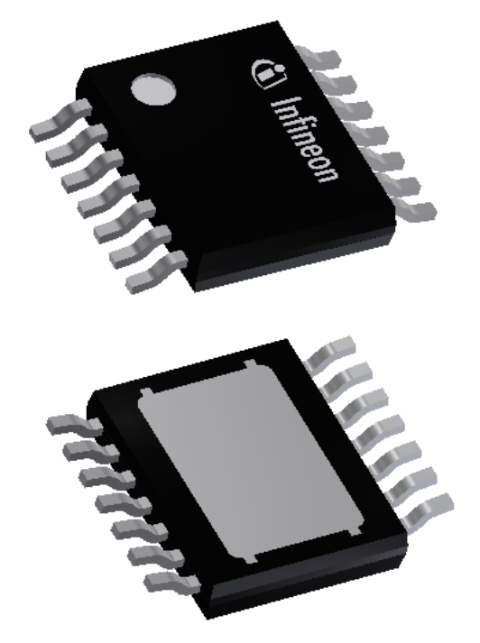

**************
Introduction
**************
Welcome to the Infineon Smart High-Side Switch library docs!

Scope
=====
This library covers the following products:

.. |trade|    unicode:: U+2122 .. TRADEMARK SIGN

PROFET\ |trade|\ + 24V family
-----------------------------

Shields for Arduino
"""""""""""""""""""

* `24V Protected Switch Shield with BTT6030-2EKA and BTT6020-1EKA`_

Chip only
"""""""""

* `BTT6020-1EKA`_
* `BTT6030-2EKA`_

12V Protected Switches
----------------------

Shields for Arduino
"""""""""""""""""""

* `12V Protected Switch Shield with BTS50010-1TAD`_
* `12V Protected Switch Shield with BTS50015-1TAD`_

Chip only
"""""""""

* `BTS50010-1TAD`_
* `BTS50015-1TAD`_

Smart High-Side Power Switches
------------------------------

Shields for Arduino
"""""""""""""""""""

* `SHIELD_BTS7002-1EPP`_
* `SHIELD_BTS7004-1EPP`_
* `SHIELD_BTS7006-1EPP`_
* `SHIELD_BTS7008-1EPP`_

Chip only
"""""""""

* `BTS7002-1EPP`_
* `BTS7004-1EPP`_
* `BTS7006-1EPP`_
* `BTS7008-1EPP`_

.. _`BTT6020-1EKA`: https://www.infineon.com/cms/en/product/power/smart-low-side-high-side-switches/high-side-switches/profet-plus-24v-automotive-smart-high-side-switch/btt6020-1era/
.. _`BTT6030-2EKA`: https://www.infineon.com/cms/en/product/power/smart-low-side-high-side-switches/high-side-switches/profet-plus-24v-automotive-smart-high-side-switch/btt6030-2era/
.. _`BTS50010-1TAD`: https://www.infineon.com/cms/en/product/power/smart-low-side-high-side-switches/high-side-switches/power-profet-automotive-smart-high-side-switch/bts50010-1tad/
.. _`BTS50015-1TAD`: https://www.infineon.com/cms/en/product/power/smart-low-side-high-side-switches/high-side-switches/power-profet-automotive-smart-high-side-switch/bts50015-1tad/
.. _`BTS7002-1EPP`: https://www.infineon.com/cms/en/product/power/smart-low-side-high-side-switches/high-side-switches/profet-plus-2-12v-automotive-smart-high-side-switch/bts7002-1epp/?redirId=103258
.. _`BTS7004-1EPP`: https://www.infineon.com/cms/en/product/power/smart-low-side-high-side-switches/high-side-switches/profet-plus-2-12v-automotive-smart-high-side-switch/bts7004-1epp/
.. _`BTS7006-1EPP`: https://www.infineon.com/cms/en/product/power/smart-low-side-high-side-switches/high-side-switches/profet-plus-2-12v-automotive-smart-high-side-switch/bts7006-1epp/
.. _`BTS7008-1EPP`: https://www.infineon.com/cms/en/product/power/smart-low-side-high-side-switches/high-side-switches/profet-plus-2-12v-automotive-smart-high-side-switch/bts7008-1epp/
.. _`24V Protected Switch Shield with BTT6030-2EKA and BTT6020-1EKA`: https://www.infineon.com/cms/en/product/evaluation-boards/24v_shield_btt6030/
.. _`12V Protected Switch Shield with BTS50010-1TAD`: https://www.infineon.com/cms/en/product/evaluation-boards/shield_bts50010-1tad/
.. _`12V Protected Switch Shield with BTS50015-1TAD`: https://www.infineon.com/cms/en/product/evaluation-boards/shield_bts50015-1tad/
.. _`SHIELD_BTS7002-1EPP`: https://www.infineon.com/cms/en/product/evaluation-boards/shield_bts7002-1epp/
.. _`SHIELD_BTS7004-1EPP`: https://www.infineon.com/cms/en/product/evaluation-boards/shield_bts7004-1epp/
.. _`SHIELD_BTS7006-1EPP`: https://www.infineon.com/cms/en/product/evaluation-boards/shield_bts7006-1epp/
.. _`SHIELD_BTS7008-1EPP`: https://www.infineon.com/cms/en/product/evaluation-boards/shield_bts7008-1epp/

License
=======

Please find the license file for this library `here <https://github.com/Infineon/high-side-switch/blob/master/LICENSE>`_.

.. toctree::
   :maxdepth: 3
   :caption: Wiki Sections
   :hidden:

   Introduction <self>
   Hardware Platforms <hardware-platforms.rst>
   Related Links <links.rst>

.. toctree::
   :maxdepth: 3
   :caption: Library Details
   :hidden:

   BGT60 API <lib-details/bgt60-api.rst>
   PAL Interface <lib-details/pal-interface.rst>
   Preprocessor Configuration <lib-details/preprocessor-config.rst>
   Doxygen Docs <lib-details/doxygen.rst>

.. toctree::
   :maxdepth: 3
   :caption: Hardware Platforms
   :hidden:

.. toctree::
   :maxdepth: 3
   :caption: Software Frameworks
   :hidden:

   sw-frmwk/arduino/index
   sw-frmwk/raspberrypi/index
   sw-frmwk/raspberrypi-py/index

.. toctree::
   :maxdepth: 3
   :caption: Examples
   :hidden:

   Arduino Examples <examples/example.rst>