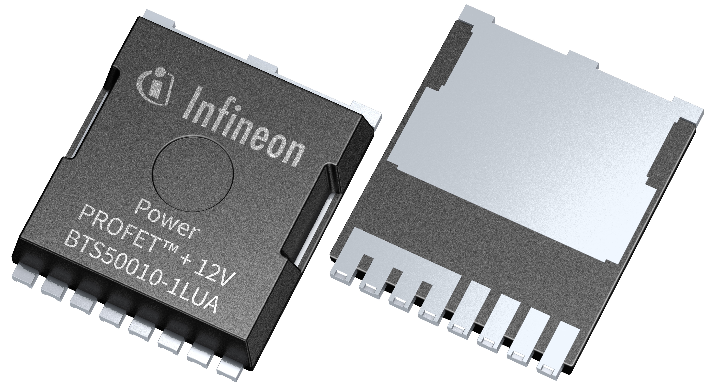
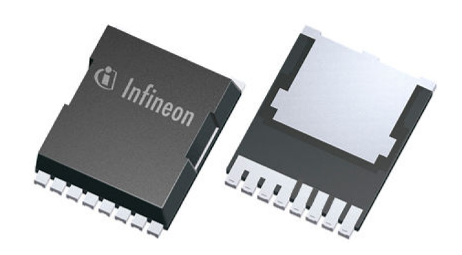

**************
Introduction
**************
Welcome to the Infineon Smart High-Side Switch library docs!

.. image:: img/btt6x_shield.jpg
    :height: 75

.. image:: img/bts5001x_shield.png
    :height: 75

.. image:: img/bts5001x_chip.jpg
    :height: 75

.. image:: img/bts700x_shield.jpg
    :height: 75

.. image:: img/bts700x_chip.png
    :height: 75

.. role:: raw-html(raw)
    :format: html

:raw-html:` `

.. image:: img/Power_PROFET_BTS500xx_1LUA.png
    :height: 75

.. image:: img/BTS50005_1LUA_Chip.jpg
    :height: 75

:raw-html:` `

.. image:: img/Power_PROFET_BTS500xx_1LUA.png
    :height: 75

Scope
=====
This library covers the following products:

.. |trade|    unicode:: U+2122 .. TRADEMARK SIGN

PROFET\ |trade|\ +2 12V family
------------------------------

* `12V Smart Switch Shield with BTS7002-1EPP`_
* `12V Smart Switch Shield with BTS7004-1EPP`_
* `12V Smart Switch Shield with BTS7006-1EPP`_
* `12V Smart Switch Shield with BTS7008-1EPP`_
* `BTS7002-1EPP`_
* `BTS7004-1EPP`_
* `BTS7006-1EPP`_
* `BTS7008-1EPP`_

PROFET\ |trade|\ + 24V family
-----------------------------

* `24V Protected Switch Shield with BTT6030-2EKA and BTT6020-1EKA`_
* `BTT6020-1EKA`_
* `BTT6030-2EKA`_

Power PROFET\ |trade|\ family
------------------------------

* `12V Protected Switch Shield with BTS50010-1TAD`_
* `12V Protected Switch Shield with BTS50015-1TAD`_
* `BTS50010-1TAD`_
* `BTS50015-1TAD`_

Power PROFET\ |trade|\ + 12V family
-----------------------------------

* `12V Protected Switch Shield with BTS50005-1LUA and BTS50010-1LUA`_
* `BTS50010-1LUA`_
* `BTS50005-1LUA`_

Power PROFET\ |trade| \ +24/48V family
--------------------------------

* `24/48V Smart High-Side Power Switch Shield with the BTH50015-1LUA and the BTH50030-1LUA`_
* `BTH50015-1LUA`_
* `BTH50030-1LUA`_

.. _`BTT6020-1EKA`: https://www.infineon.com/cms/en/product/power/smart-low-side-high-side-switches/high-side-switches/profet-plus-24v-automotive-smart-high-side-switch/btt6020-1era/
.. _`BTT6030-2EKA`: https://www.infineon.com/cms/en/product/power/smart-low-side-high-side-switches/high-side-switches/profet-plus-24v-automotive-smart-high-side-switch/btt6030-2era/
.. _`BTS50010-1TAD`: https://www.infineon.com/cms/en/product/power/smart-low-side-high-side-switches/high-side-switches/power-profet-automotive-smart-high-side-switch/bts50010-1tad/
.. _`BTS50015-1TAD`: https://www.infineon.com/cms/en/product/power/smart-low-side-high-side-switches/high-side-switches/power-profet-automotive-smart-high-side-switch/bts50015-1tad/
.. _`BTS50005-1LUA`: https://www.infineon.com/cms/de/product/power/smart-power-switches/high-side-switches/power-profet-plus-12v-automotive-smart-high-side-switch/bts50005-1lua/
.. _`BTS50010-1LUA`: https://www.infineon.com/cms/de/product/power/smart-power-switches/high-side-switches/power-profet-plus-12v-automotive-smart-high-side-switch/bts50010-1lua/
.. _`BTS7002-1EPP`: https://www.infineon.com/cms/en/product/power/smart-low-side-high-side-switches/high-side-switches/profet-plus-2-12v-automotive-smart-high-side-switch/bts7002-1epp/?redirId=103258
.. _`BTS7004-1EPP`: https://www.infineon.com/cms/en/product/power/smart-low-side-high-side-switches/high-side-switches/profet-plus-2-12v-automotive-smart-high-side-switch/bts7004-1epp/
.. _`BTS7006-1EPP`: https://www.infineon.com/cms/en/product/power/smart-low-side-high-side-switches/high-side-switches/profet-plus-2-12v-automotive-smart-high-side-switch/bts7006-1epp/
.. _`BTS7008-1EPP`: https://www.infineon.com/cms/en/product/power/smart-low-side-high-side-switches/high-side-switches/profet-plus-2-12v-automotive-smart-high-side-switch/bts7008-1epp/
.. _`24V Protected Switch Shield with BTT6030-2EKA and BTT6020-1EKA`: https://www.infineon.com/cms/en/product/evaluation-boards/24v_shield_btt6030/
.. _`12V Protected Switch Shield with BTS50010-1TAD`: https://www.infineon.com/cms/en/product/evaluation-boards/shield_bts50010-1tad/
.. _`12V Protected Switch Shield with BTS50015-1TAD`: https://www.infineon.com/cms/en/product/evaluation-boards/shield_bts50015-1tad/
.. _`12V Protected Switch Shield with BTS50005-1LUA and BTS50010-1LUA` : https://www.infineon.com/cms/en/product/evaluation-boards/board-bts50005-1lua/
.. _`12V Smart Switch Shield with BTS7002-1EPP`: https://www.infineon.com/cms/en/product/evaluation-boards/shield_bts7002-1epp/
.. _`12V Smart Switch Shield with BTS7004-1EPP`: https://www.infineon.com/cms/en/product/evaluation-boards/shield_bts7004-1epp/
.. _`12V Smart Switch Shield with BTS7006-1EPP`: https://www.infineon.com/cms/en/product/evaluation-boards/shield_bts7006-1epp/
.. _`12V Smart Switch Shield with BTS7008-1EPP`: https://www.infineon.com/cms/en/product/evaluation-boards/shield_bts7008-1epp/
.. _`12/48V Smart High-Side Power Switch with the BTH50015-1LUA and the BTH50030-1LUA`: https://www.infineon.com/cms/en/product/evaluation-boards/board-bth50015-1lua/
.. _`BTH50015-1LUA`: https://www.infineon.com/cms/de/product/power/smart-power-switches/high-side-switches/power-profet-plus-12v-automotive-smart-high-side-switch/bth50015-1lua/
.. _`BTH50030-1LUA`: https://www.infineon.com/cms/de/product/power/smart-power-switches/high-side-switches/power-profet-plus-12v-automotive-smart-high-side-switch/bth50030-1lua/

License
=======

Please find the license file for this library `here <https://github.com/Infineon/high-side-switch/blob/master/LICENSE>`_.

.. toctree::
   :maxdepth: 3
   :caption: Home
   :hidden:

   Introduction <self>

.. toctree::
   :maxdepth: 3
   :caption: Hardware Platforms
   :hidden:

   hw-platforms

.. toctree::
   :maxdepth: 3
   :caption: Library Details
   :hidden:

   Library Architecture <lib-details/library-architecture.rst>
   Porting Guide <lib-details/porting-guide.rst>

.. toctree::
   :maxdepth: 3
   :caption: Software Frameworks
   :hidden:

   sw-frmwk/arduino/index

.. toctree::
   :maxdepth: 5
   :caption: API Reference
   :hidden:

   Modules     <api-reference/modules.rst>
   Full API    <exhale-auto-docs/unabridged_api.rst>
   File List   <exhale-auto-docs/file_view_hierarchy.rst>

.. toctree::
   :maxdepth: 3
   :caption: Related Links
   :hidden:

   links