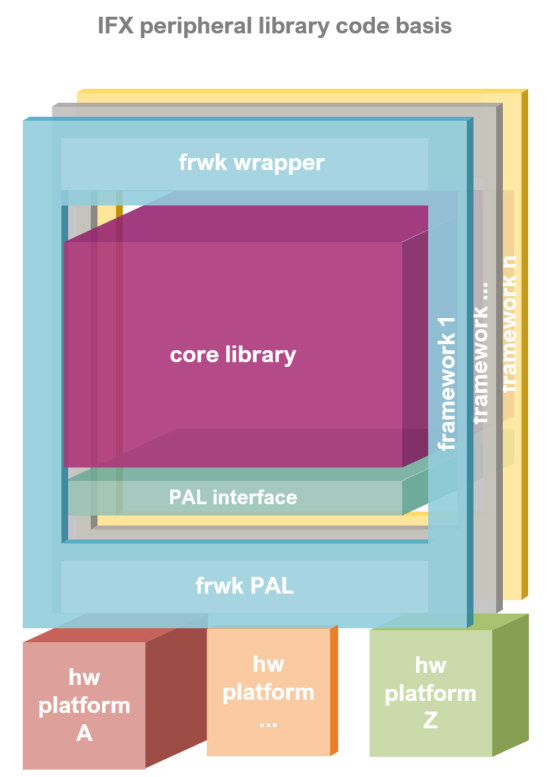
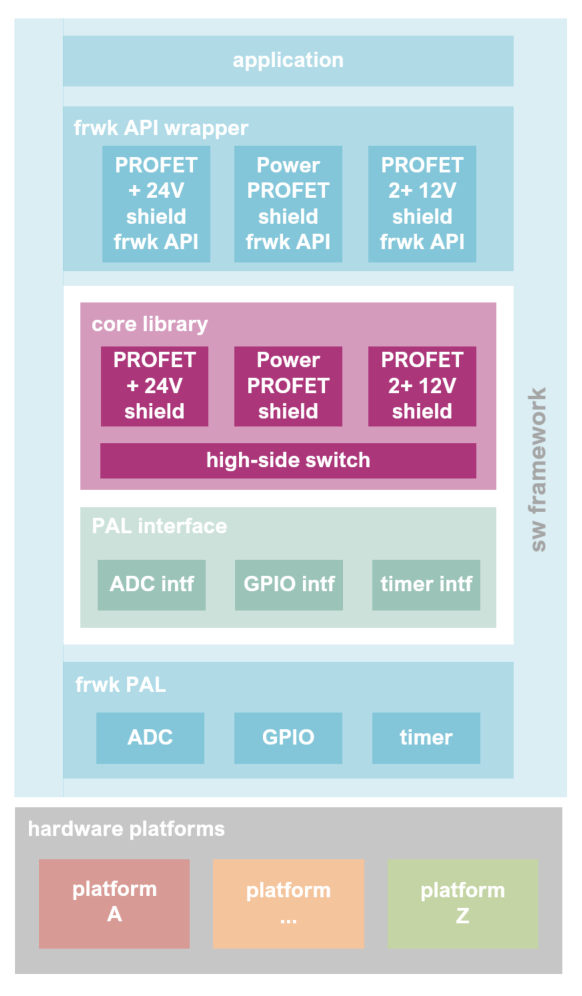

Library Architecture
--------------------

The High-side Switch library follows the architecture pattern shown in the stack diagram:

The monolithic core library can be universally integrated across any low level peripheral drivers, embedded operating system, and middleware of each software framework.

The reusability and interoperability is achieved by defining a Platform Abstraction Layer (PAL) interface which is implemented by each framework for its specific hardware abstraction layer and operating system resources APIs.

Additionally, the core library API is accommodated and adapted to the particularities of each software framework. The framework API wrappers intend to harmonize the core library API with that of the software development framework in which it is integrated, making it easier for the users already familiarized with the development framework.

The support for the multiple hardware platforms is then provided by each development framework.

The specific High-side Switch library modules are depicted more specifically below:

In the next sections, the information of the main architecture modules for the High-side Switch library is extended.
To explore the specific code implementation, navigate to the :ref:`Reference API <modules>` section

Core Library
""""""""""""

The core library contains all the library logic and high level functionalities of the sensor peripheral. The core library remains C++ agnostic by interacting with the specific platform (and framework) through a Platform Abstraction Layer interface. No other dependencies than standard C/C++ modules and the PAL are found in these sources.

Additionally to the Hss class, a HssShield implements an abstract interface to be used by the shields core API implementations. 
Each shield family includes its specialization, and uses the number of high-side switch instances required for a given shield.

These code sources can be found under "src/corelib".

The core lib API provides access to all High-side Switch functionalities given the instances to the required PAL instances. Find more information in the :ref:`High-side Switch API <Hss API>` and the different :ref:`High-side Switch Shields API <core-lib>` sections.

Platform Abstraction Layer (PAL) Interface
""""""""""""""""""""""""""""""""""""""""""

The Platform Abstraction Layer Interface is implemented via abstract C++ classes declaring all the necessary platform resources and functionalities that need to be provided by the specific framework-platform implementation.

The simple High-side Switch specifies in its PAL modules an ADC class, a GPIO class, and a Timer class. Its implementation is located in the "src/pal" folder.

The PAL interfaces functions, behavior description and implementation details, can be found in the :ref:`PAL Interface <pal-intf>` section.

Framework PAL
"""""""""""""

The PAL interfaces is defined for each embedded software framework through its low level peripheral drivers and operating system resources APIs. The ADC, GPIO and Timer interface abstract classes are inherited and defined in this layer.

The "src/framework/sample_fmwk/pal" folder contains the pal implementation for the particular framework.

Find more information about the supported software development frameworks in the Software Frameworks section.

Framework API Wrapper
"""""""""""""""""""""

The idea behind this layer is to adapt the library in order to comply with the programming conventions of the integrated programming framework or ecosystem.

Operating system libraries, low level driver of hardware peripherals (digital input/outputs, PWM, analog conversion, etc.) or other middleware resources are implemented for each development framework following certain patterns for functions, parameters, and primitive types.

At these level, certain platform functionalities required by High-side Switch can be already defined and adapted to the API available resources: functions prototypes, framework core libraries, low level driver HAL, programming patterns, and even framework feel and look aspects.

The frameworks wrapper API files are located in the "src/framework/sample_fmwk/wrapper" folders.

Find more information about each software development frameworks API in the Software Frameworks section.

Predefined Hardware Platforms
"""""""""""""""""""""""""""""

Given a particular hardware platform and development software framework, most of the resources and its configuration can be already determined by default. This part of the framework API just define some pre configured instances for common and officially supported evaluation kits based configuration.

These instances are available in the "src/framework/sample_fmwk/wrapper/zzz-platf-xxx.hpp/cpp" source files.

