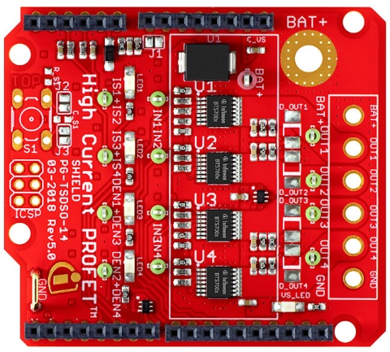

.. _arduino-examples:

Arduino Examples
================
To run these examples use either the Arduino IDE or something similar like the PlatformIO extension for Visual Code or Atom.

* :code:`examples/BTT-high-side-switch` - Default high-side-switch test. Compatible with BTT60xx variants.
* :code:`examples/BTS-high-side-switch` - Default high-side-switch test. Compatible with BTS5001x and BTS700x variants.
* :code:`examples/BTS-button-test` - Switch dependent on optional user button. Compatible with BTS5001x and BTS700x variants.

All Arduino sketches are also available for the other included platforms. See below :code:`src/framework/PLATFORM` directory.

BTT-high-side-switch
""""""""""""""""""""
Summary
^^^^^^^
Default high-side-switch test. Compatible with BTT60xx variants.

Compatibility
^^^^^^^^^^^^^
.. image:: ../../img/btt6x_shield.jpg
    :width: 150

.. list-table::
    :header-rows: 1

    * - Shield
      - Included Variants
      - Supported Channels
    * - 24V_SHIELD_BTT6030
      - Profet 0 (BTT6030-2ERA)
      - 2
    * - 
      - Profet 1 (BTT6030-2ERA)
      - 2
    * - 
      - Profet 2 (BTT6020-1ERA)
      - 1

Description
^^^^^^^^^^^
This example shows the usage of the offered functionalities of the shield. It includes:
 * Switching the channels on/off one after the other
 * Switching multiple channels on/off at once
 * Read the current flowing through the channel
 * Perform diagnosis for individual channel while switch is ON

BTS-high-side-switch
""""""""""""""""""""
Summary
^^^^^^^
Default high-side-switch test. Compatible with BTS5001x and BTS700x variants.

Compatibility
^^^^^^^^^^^^^
.. image:: ../../img/bts5001x_shield.png
    :width: 150

Description
^^^^^^^^^^^
This example shows the usage of the offered functionalities of the shield. It includes:
 * Switching the channels on/off one after the other (in case if multiple channels supported)
 * Switching multiple channels on/off at once (supported only in BTS700x variants)
 * Read the current flowing through the channel
 * Perform diagnosis for individual channel
 * Read battery voltage at any instant of time

This example can be used for both, BTS700x and BTS5001x shields.

.. warning::
    Some functions like turning on/off multiple switches at once is not supported for the BTS5001x-1TAD shields and hence would not serve as a valid function call. Please read the inline code comments for better understanding.

BTS-button-test
"""""""""""""""
Summary
^^^^^^^
Switch dependent on optional user button. Compatible with BTS5001x and BTS700x variants.

Compatibility
^^^^^^^^^^^^^
.. image:: ../../img/bts5001x_shield.png
    :width: 150

.. list-table::
    :header-rows: 1

    * - Type
      - Variant
      - Covered by
    * - Shield
      - BTS7002
      - :code:`hss-bts700xShield-ino.hpp`
    * - Shield
      - BTS7004
      - :code:`hss-bts700xShield-ino.hpp`
    * - Shield
      - BTS7006
      - :code:`hss-bts700xShield-ino.hpp`
    * - Shield
      - BTS7008
      - :code:`hss-bts700xShield-ino.hpp`
    * - Shield
      - BTS50010
      - :code:`hss-bts500xxShield-ino.hpp`
    * - Shield
      - BTS50015
      - :code:`hss-bts500xxShield-ino.hpp`

Description
^^^^^^^^^^^
BTS700x-1EPP and BTS5001x-1TAD Shields have optional user button to perform switching.
This example demonstrates the use of optional user button. This functionality is not included in the main example, because the button is not populated on the board by default.