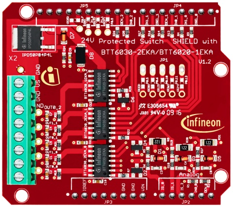

.. _arduino-examples:

Arduino Examples
================
To run these examples use either the Arduino IDE or something similar like the PlatformIO extension for Visual Code or Atom.

.. list-table::
    :header-rows: 1

    * - Example 
      - Summary 
    * - :code:`examples/BTT600x-hss-advanced`
      - * Default high-side-switch advanced test. 
        * Compatible with BTT60xx variants.
    * - :code:`examples/BTT600x-hss-multiple-ch`
      - * High-side-switch example to operate multiple channels. 
        * Compatible with BTT60xx variants.
    * - :code:`examples/BTT600x-hss-single-ch`  
      - * Basic High-side-switch example to operate single channel. 
        * Compatible with BTT60xx variants.
    * - :code:`examples/BTS700x-hss-advanced`   
      - * Default high-side-switch advanced test. 
        * Compatible with BTS7002, BTS7004, BTS7006, BTS7008 variant.
    * - :code:`examples/BTS700x-hss-multiple-ch`
      - * High-side-switch example to operate multiple channels. 
        * Compatible with BTS7002, BTS7004, BTS7006, BTS7008 variant.
    * - :code:`examples/BTS700x-hss-single-ch`  
      - * Basic High-side-switch example to operate single channel. 
        * Compatible with BTS7002, BTS7004, BTS7006, BTS7008 variant.
    * - :code:`examples/BTS700x-button-test`    
      - * Switch dependent on optional user button. 
        * Compatible with BTS7002, BTS7004, BTS7006, BTS7008 variant.
    * - :code:`examples/BTS5001x-hss-advanced`   
      - * Default high-side-switch advanced test. 
        * Compatible with BTS50010 and BTS50015 variant.
    * - :code:`examples/BTS5001x-hss-single-ch`  
      - * Basic High-side-switch example to operate single channel. 
        * Compatible with BTS50010 and BTS50015 variant.
    * - :code:`examples/BTS5001x-button-test`    
      - * Switch dependent on optional user button. 
        * Compatible with BTS50010 and BTS50015 variant.

All Arduino sketches are also available for the other included frameworks. See below :code:`src/framework/FRAMEWORK` directory.

BTT600x-hss-advanced
""""""""""""""""""""
Summary
^^^^^^^
Default high-side-switch advanced test. Compatible with BTT60xx variants.

Compatibility
^^^^^^^^^^^^^

.. list-table::
    :header-rows: 1

    * - Shield
      - Included Variants
      - Supported Channels
    * - 24V_SHIELD_BTT6030
      - Profet 0 (BTT6030-2ERA)
      - 2
    * - 
      - Profet 1 (BTT6030-2ERA)
      - 2
    * - 
      - Profet 2 (BTT6020-1ERA)
      - 1

Description
^^^^^^^^^^^
This example shows the usage of the offered functionalities of the shield. 
It has 2 parts:

1. PART A:
  * Switches a channel ON
  * Reads current through the switch, battery voltage and performs diagnosis in 'ON' state
  * Switches the channel OFF

2. PART B:
  * Switch multiple channels 'ON' at once
  * Switch multiple channels 'OFF' at once
 
BTT600x-hss-multiple-ch
""""""""""""""""""""""""
Summary 
^^^^^^^
High-side-switch example to operate multiple channels. Compatible with BTT60xx variants.

Compatibility
^^^^^^^^^^^^^

.. list-table::
    :header-rows: 1

    * - Shield
      - Included Variants
      - Supported Channels
    * - 24V_SHIELD_BTT6030
      - Profet 0 (BTT6030-2ERA)
      - 2
    * - 
      - Profet 1 (BTT6030-2ERA)
      - 2
    * - 
      - Profet 2 (BTT6020-1ERA)
      - 1

Description
^^^^^^^^^^^
This example demonstrates how to switch on/off multiple channels at once.
In total, there are 5 channels provided in this board. Through this example,
you can control these 5 channels at the same time by setting the required channels 
to true in the :code:`switch_no[5]` where index-0 maps to channel 0. See below channel to port mapping:

.. list-table::
    :header-rows: 1

    * - Channel (in example code)
      - Controls
      - Mapped output port
    * - :code:`switch_no[0] = true`
      - Profet 0 (BTT6030-2ERA part 0 : channel 0)
      - OUT 0.0
    * - :code:`switch_no[1] = true`
      - Profet 0 (BTT6030-2ERA part 0 : channel 1)
      - OUT 0.1
    * - :code:`switch_no[2] = true`
      - Profet 1 (BTT6030-2ERA part 1 : channel 0)
      - OUT 1.0
    * - :code:`switch_no[3] = true`
      - Profet 1 (BTT6030-2ERA part 1 : channel 1)
      - OUT 1.1
    * - :code:`switch_no[4] = true`
      - Profet 2 (BTT6020-1ERA : channel 0)
      - OUT 2

BTT600x-hss-single-ch
""""""""""""""""""""""
Summary 
^^^^^^^
Basic High-side-switch example to operate single channel. Compatible with BTT60xx variants.

Compatibility
^^^^^^^^^^^^^

.. list-table::
    :header-rows: 1

    * - Shield
      - Included Variants
      - Supported Channels
    * - 24V_SHIELD_BTT6030
      - Profet 0 (BTT6030-2ERA)
      - 2
    * - 
      - Profet 1 (BTT6030-2ERA)
      - 2
    * - 
      - Profet 2 (BTT6020-1ERA)
      - 1

Description
^^^^^^^^^^^
This is a basic high-side-switch example that demonstrates how to switch on/off a specific channel.
Along with channel operation, you could also determine the sensed current of the channel.
In total, there are 5 channels provided in this board and you can select which channel to function by setting 
correct number in :code:`switch_no`. See below switch to port mapping:

.. list-table::
    :header-rows: 1

    * - Channel (in example code)
      - Controls
      - Mapped output port
    * - :code:`switch_no = 0`
      - Profet 0 (BTT6030-2ERA part 0 : channel 0)
      - OUT 0.0
    * - :code:`switch_no = 1`
      - Profet 0 (BTT6030-2ERA part 0 : channel 1)
      - OUT 0.1
    * - :code:`switch_no = 2`
      - Profet 1 (BTT6030-2ERA part 1 : channel 0)
      - OUT 1.0
    * - :code:`switch_no = 3`
      - Profet 1 (BTT6030-2ERA part 1 : channel 1)
      - OUT 1.1
    * - :code:`switch_no = 4`
      - Profet 2 (BTT6020-1ERA : channel 0)
      - OUT 2

BTS700x-hss-advanced
""""""""""""""""""""
Summary
^^^^^^^
Default high-side-switch advanced test. Compatible with BTS7002, BTS7004, BTS7006 and BTS7008 variant.

Compatibility
^^^^^^^^^^^^^
.. image:: ../../img/bts700x_shield.jpg
    :width: 150

.. list-table::
    :header-rows: 1

    * - Type
      - Variant
      - Covered by
    * - Shield
      - BTS7002
      - :code:`hss-bts700xShield-ino.hpp`
    * - Shield
      - BTS7004
      - :code:`hss-bts700xShield-ino.hpp`
    * - Shield
      - BTS7006
      - :code:`hss-bts700xShield-ino.hpp`
    * - Shield
      - BTS7008
      - :code:`hss-bts700xShield-ino.hpp`

Description
^^^^^^^^^^^
This example shows the usage of all the offered functionalities of the shield. 
It has 2 parts:

1. PART A
  * Switches a channel ON
  * Reads current through the switch, battery voltage and performs diagnosis in 'ON' state
  * Switches the channel OFF
  * Reads current through the switch, battery voltage and performs diagnosis in 'OFF' state

2. PART B
  * Switch multiple channels 'ON' at once
  * Switch multiple channels 'OFF' at once

BTS700x-hss-multiple-ch
""""""""""""""""""""""""
Summary 
^^^^^^^
High-side-switch example to operate multiple channels. Compatible with BTS7002, BTS7004, BTS7006, BTS7008 variants.

Compatibility
^^^^^^^^^^^^^
.. image:: ../../img/bts700x_shield.jpg
    :width: 150

.. list-table::
    :header-rows: 1

    * - Type
      - Variant
      - Covered by
    * - Shield
      - BTS7002
      - :code:`hss-bts700xShield-ino.hpp`
    * - Shield
      - BTS7004
      - :code:`hss-bts700xShield-ino.hpp`
    * - Shield
      - BTS7006
      - :code:`hss-bts700xShield-ino.hpp`
    * - Shield
      - BTS7008
      - :code:`hss-bts700xShield-ino.hpp`
  
Description
^^^^^^^^^^^
This example demonstrates how to switch on/off multiple channels at once.
In total, there are 4 channels provided in this board. Through this example,
you can control these 4 channels at the same time by setting the required channels 
to true in the :code:`switch_no[4]` where index-0 maps to channel 1. See below channel to port mapping:

.. list-table::
  :header-rows: 1
    
  * - Channel (in example code)
    - Controls
    - Mapped output port
  * - :code:`switch_no[0]`
    - BTS700x U1
    - OUT1
  * - :code:`switch_no[1]`
    - BTS700x U2
    - OUT2
  * - :code:`switch_no[2]`
    - BTS700x U3
    - OUT3
  * - :code:`switch_no[3]`
    - BTS700x U4
    - OUT4

BTS700x-hss-single-ch
""""""""""""""""""""""
Summary 
^^^^^^^
Basic High-side-switch example to operate single channel. Compatible with BTT7002, BTS7004, BTS7006 and BTS7008 variants.

Compatibility
^^^^^^^^^^^^^
.. image:: ../../img/bts700x_shield.jpg
    :width: 150

.. list-table::
    :header-rows: 1

    * - Type
      - Variant
      - Covered by
    * - Shield
      - BTS7002
      - :code:`hss-bts700xShield-ino.hpp`
    * - Shield
      - BTS7004
      - :code:`hss-bts700xShield-ino.hpp`
    * - Shield
      - BTS7006
      - :code:`hss-bts700xShield-ino.hpp`
    * - Shield
      - BTS7008
      - :code:`hss-bts700xShield-ino.hpp`

Description
^^^^^^^^^^^
This is a basic high-side-switch example that demonstrates how to switch on/off a specific channel.
Along with channel operation, you could also determine the sensed current of the channel.
In total, there are 4 channels provided in the board and 
you can select which channel to operate by setting correct number in :code:`switch_no`. See below channel to port mapping:

.. list-table::
    :header-rows: 1
    
    * - Channel (in example code)
      - Controls
      - Mapped output port
    * - :code:`switch_no = 1`
      - BTS700x U1
      - OUT1
    * - :code:`switch_no = 2`
      - BTS700x U2
      - OUT2
    * - :code:`switch_no = 3`
      - BTS700x U3
      - OUT3
    * - :code:`switch_no = 4`
      - BTS700x U4
      - OUT4

BTS700x-button-test
""""""""""""""""""""
Summary
^^^^^^^
Switch dependent on optional user button. Compatible with BTS7002, BTS7004, BTS7006, BTS7008 variants.

Compatibility
^^^^^^^^^^^^^
.. image:: ../../img/bts700x_shield.jpg
    :width: 150

.. list-table::
    :header-rows: 1

    * - Type
      - Variant
      - Covered by
    * - Shield
      - BTS7002
      - :code:`hss-bts700xShield-ino.hpp`
    * - Shield
      - BTS7004
      - :code:`hss-bts700xShield-ino.hpp`
    * - Shield
      - BTS7006
      - :code:`hss-bts700xShield-ino.hpp`
    * - Shield
      - BTS7008
      - :code:`hss-bts700xShield-ino.hpp`

Description
^^^^^^^^^^^
BTS700x-1EPP Shield has an optional user button to perform switching.
This example demonstrates the use of optional user button. This shield supports both 
digital and analog read button functionality which is configurable through jumpers (Refer manual for details).

.. list-table::
    :header-rows: 1

    * - Jumper used
      - Read button Function
    * - J2
      - analogReadButton()
    * - J3
      - digitalReadButton()

In this example we use the digitalReadButton() functionality of the library
to read out the VSS of the attached power supply. In case you wish to use analogReadButton()
functionality, replace digitalReadButton() by analogReadButton().  

BTS5001x-hss-advanced
""""""""""""""""""""""
Summary
^^^^^^^
Default high-side-switch advanced test. Compatible with BTS50010 and BTS50015 variants.

Compatibility
^^^^^^^^^^^^^
.. image:: ../../img/bts5001x_shield.png
    :width: 150

.. list-table::
    :header-rows: 1

    * - Type
      - Variant
      - Covered by
    * - Shield
      - BTS50010
      - :code:`hss-bts500xxShield-ino.hpp`
    * - Shield
      - BTS50015
      - :code:`hss-bts500xxShield-ino.hpp`

Description
^^^^^^^^^^^
This example shows the usage of the offered functionalities of the shield. It does the following:
 * Switches a channel ON
 * Reads current through the switch, battery voltage and performs diagnosis in 'ON' state
 * Switches the channel OFF

This is a single channel supporting shield and hence the default configurations for channels are set in the library.

BTS5001x-hss-single-ch
""""""""""""""""""""""
Summary 
^^^^^^^
Basic High-side-switch example to operate single channel. Compatible with BTS50010 and BTS50015 variants.

Compatibility
^^^^^^^^^^^^^
.. image:: ../../img/bts5001x_shield.png
    :width: 150

.. list-table::
    :header-rows: 1

    * - Type
      - Variant
      - Covered by
    * - Shield
      - BTS50010
      - :code:`hss-bts500xxShield-ino.hpp`
    * - Shield
      - BTS50015
      - :code:`hss-bts500xxShield-ino.hpp`

Description
^^^^^^^^^^^
This is a basic high-side-switch example that demonstrates how to switch on/off a specific channel.
Along with channel operation, you could also determine the sensed current of the channel.

BTS5001x-button-test
""""""""""""""""""""
Summary
^^^^^^^
Switch dependent on optional user button. Compatible with BTS50010 and BTS50015 variants.

Compatibility
^^^^^^^^^^^^^
.. image:: ../../img/bts5001x_shield.png
    :width: 150

.. list-table::
    :header-rows: 1

    * - Type
      - Variant
      - Covered by
    * - Shield
      - BTS50010
      - :code:`hss-bts500xxShield-ino.hpp`
    * - Shield
      - BTS50015
      - :code:`hss-bts500xxShield-ino.hpp`

Description
^^^^^^^^^^^
BTS5001x-1TAD Shields have optional user button to perform switching.
This example demonstrates the use of optional user button.