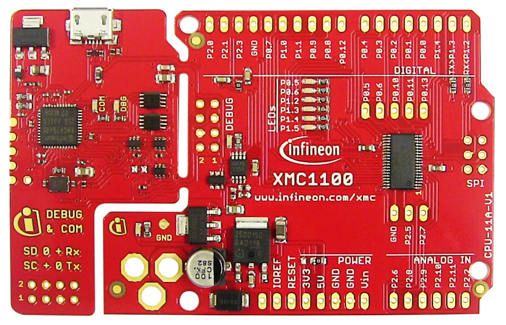
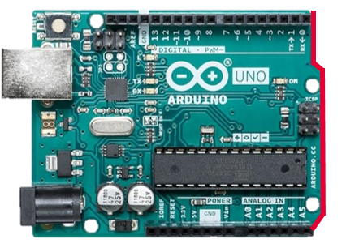
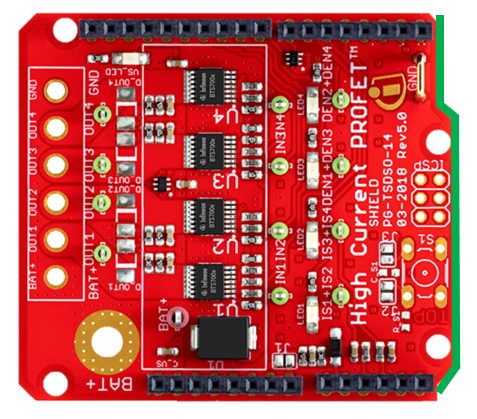
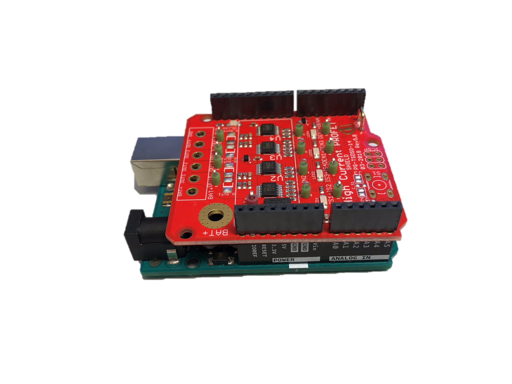
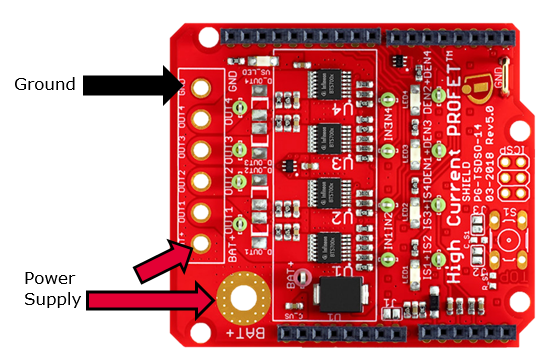

.. _arduino-examples:

Arduino Getting Started
=======================

Overview
--------

This getting started guide helps you to properly connect a `Smart High-Side Power Switch shield`_ with the right platform and teaches you how to install the required software to use the Infineon High-Side Switches.

.. _`Smart High-Side Power Switch shield`: https://www.infineon.com/cms/en/product/evaluation-boards/shield_bts7002-1epp/

Required Hardware
-----------------

Microcontroller
"""""""""""""""
Any Arduino compatible board with Arduino Uno form-factor, like XMC1100 Boot Kit or other Arduino compatible XMC boards from Infineon:

Smart High-Side Power Switch Shield
"""""""""""""""""""""""""""""""""""

.. image:: ../../img/bts700x_shield.jpg
    :height: 200

Required Software
-----------------

* `Arduino IDE`_
* This library installed in the Arduino IDE, the instructions can be found `here <https://www.arduino.cc/en/guide/libraries>`__
* When using an Arduino compatible XMC board, please find installation instructions `here <https://github.com/Infineon/XMC-for-Arduino#installation-instructions>`_.

Tutorial
--------

Software Installation
""""""""""""""""""""""

1. **Install the Arduino IDE**. If you are new to Arduino, please `download <https://www.arduino.cc/en/Main/Software>`__ the program and install it first.

2. **Include the XMC boards in the IDE (if a XMC is used)**. The official Arduino boards are already available in the Arduino IDE, but other third party boards as the Infineon XMC MCU based ones need to be explicitly included. Follow the instructions in the `link <https://github.com/Infineon/XMC-for-Arduino#installation-instructions>`__ to add the XMC board family to the Arduino IDE.

3. **Install the library**. In the Arduino IDE, go to the menu *Sketch > Include library > Library Manager*. Type **high-side-switch** and install the library.

Hardware Setup
""""""""""""""

The shield can be used with all platforms that support the Arduino form factor. But please be aware that all these platforms have to have the same pin functionalities as the Arduino. Otherwise the full functionality of the shield can not be assured.

To connect the shield you just have to assure that the notch of the Arduino Uno and the shield are above each other. Then you can plug the shield on top of the Arduino.

The pin headers can also be used to figure out the right orientation. There is only one way to properly connect them.

As soon as the shield is connected to the Arduino you can connect a USB cable to the Arduino to power up the microcontroller. Make sure that no code or the example code of this repository is flashed to the microcontroller. Otherwise it can happen that the board is already activating one of the switches.

Now you can attach the power supply to the battery pad on the board. There are two, one for a large wire gauge and the other is next to the switches pads and is meant for smaller cables. Don't forget to connect the ground wire!

Now you only have to attach your load to the desired switch. For getting familiar with the board it is recommended to use a resistive load to check the functionality of the board and the shield.

Ready To Go!
""""""""""""

- TODO: How to run example needs to be added -

For a specific description and overview of all examples please refer to :ref:`Arduino examples <arduino-examples>`.